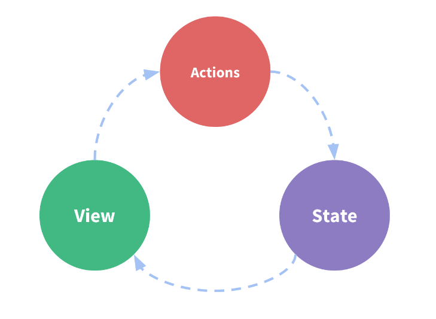

#### 목차

- [React](#react)
  * [1. Redux](#1-redux)
    + [1-1. 설치하기](#1-1-설치하기)
    + [1-2. 기본 개념](#1-2-기본-개념)
    + [1-3. 언제 사용해야 좋은가](#1-3-언제-사용해야-좋은가)
  * [2. Redux 용어 및 개념](#2-redux-용어-및-개념)
    + [2-1. State Management](#2-1-state-management)
    + [2-2. Immutability](#2-2-immutability)
    + [2-3. 용어 설명](#2-3-용어-설명)
  * [출처](#출처)

# React

## 1. Redux

### 1-1. 설치하기

```bash
$yarn add @reduxjs/toolkit

$yarn add redux
```

- redux tookit
  - 기존 redux의 복잡도를 낮추고 사용성을 높이기 위해 만들어짐

### 1-2. 기본 개념

- 앱의 state는 하나의 저장소(store) 안에 있는 객체 트리에 저장됨
- 상태 트리를 변경하는 유일한 방법은 action을 생성하는 것
- 어떻게 action이 state를 업데이트할지 명시하기 위해서 reducer를 작성해야함
  - 이전 state와 action을 기반으로 한 새로운 state를 계산

```react
// state는 배열, 객체 등 다양함
// state object를 변경해서는 안됨 -> 상태가 바뀌면 새로운 객체가 반환됨
function counterReducer(state = { value: 0 }, action) {
  switch (action.type) {
    case 'counter/incremented':
      return { value: state.value + 1 }
    case 'counter/decremented':
      return { value: state.value - 1 }
    default:
      return state
  }
}

// Redux 저장소 생성
// API -> { subscribe, dispatch, getState }
let store = createStore(counter)

// subscribe()를 통해 상태 변화에 따라 UI를 변경시킬 수 있음
store.subscribe(() => console.log(store.getState()))

// state를 변경시키기 위한 유일한 방법은 액션을 보내는 것뿐임
store.dispatch({ type: 'counter/incremented' })
// {value: 1}
store.dispatch({ type: 'counter/incremented' })
// {value: 2}
store.dispatch({ type: 'counter/decremented' })
// {value: 1}
```

- 상태를 바로 변경하는 대신, 액션을 통해 변경을 명시하고 이러한 각각의 액션이 어떻게 앱의 상태를 변경할지 결정하는 함수인 reducer를 작성
- 보통 하나의 root reduer함수를 가진 단 하나의 저장소가 존재
  - 앱이 커짐에 따라 상태 트리의 서로 다른 부분에서 개별적으로 동작하는 작은 reducer들로 나눌 수 있음

### 1-3. 언제 사용해야 좋은가

- 앱의 여러 위치에서 많은 양의 상태 관리가 필요할 때
- 앱의 state가 자주 변경될 때
- 상태를 업그레이드하는 로직이 복잡할 때
- 앱에 중형 또는 대형 코드베이스가 있고 많은 사람들이 이를 작업할 때


## 2. Redux 용어 및 개념

### 2-1. State Management

```react
function Counter() {
  // State: a counter value
  const [counter, setCounter] = useState(0)

  // Action: code that causes an update to the state when something happens
  const increment = () => {
    setCounter(prevCounter => prevCounter + 1)
  }

  return (
    <div>
      Value: {counter} <button onClick={increment}>Increment</button>
    </div>
  )
}
```

- state : 앱을 작동하게 만드는 진정한 근원
- action : 사용자 입력에 따라 앱에서 발생하는 이벤트 및 상태에서 업데이트를 진행
- view : 현재 상태를 기반으로한 UI의 선언적 설명
- 단방향 데이터 흐름 (one-way data flow)
  - state는 특정 시점이 앱의 상태를 나타냄
  - UI는 해당 상태를 기반으로 렌더링됨
  - 이벤트가 발생하면 해당 상황에 따라 state가 업데이트됨
  - UI는 새로운 상태를 기반으로 다시 렌더링됨



- 같은 state를 사용하고 공유해야하는 컴포넌트가 많은 경우, 특히 이러한 컴포넌트들이 앱의 다른 부분에 위치하는 경우에 단순성이 무너질 수 있음 
  - 간혹 state를 위로 끌어올리는 것으로 해결할 수도 있지만 항상 해결되는 것은 아님

- 이를 해결하는 방법은 컴포넌트에서 공유된 state를 추출하여 컴포넌트 트리 외부의 중앙에 두는 것
  - 이를 통해 트리는 큰 View가 되고 위치에 관계없이 state에 접근하거나 update할 수 있음

- 상태 관리와 관련된 개념을 나누고 정의함으로써 View와 State간의 독립성을 유지하는 규칙을 적용하여 코드를 작성할 때 더 구조적이고 유지보수 가능하게 도와줌
- Redux는 중앙 집중식 단일 장소에 global state를 위치시키고 state를 업데이트할 때 코드를 예측 가능하게 만들기 위해서  따라야하는 구체적인 패턴

### 2-2. Immutability

- mutable은 변할 수 있음을 의미하고 immutable은 절대 변할 수 없음을 의미함
- Javascript의 object와 array는 기본적으로 mutable함
- immutable하게 값을 업데이트하기 위해선 기존 코드의 복사본을 만든 후 해당 복사본을 수정해야 함

```javascript
const obj = {
  a: {
    // To safely update obj.a.c, we have to copy each piece
    c: 3
  },
  b: 2
}

// spread operator를 사용하여 복사
const obj2 = {
  // copy obj
  ...obj,
  // overwrite a
  a: {
    // copy obj.a
    ...obj.a,
    // overwrite c
    c: 42
  }
}

// array.concat()
// 인자로 주어진 배열이나 값들을 기존 배열에 합쳐서 새로운 배열을 반환
const arr = ['a', 'b']
// Create a new copy of arr, with "c" appended to the end
const arr2 = arr.concat('c')

// array.slice()
// 얕은 복사
// or, we can make a copy of the original array:
const arr3 = arr.slice()
// and mutate the copy:
arr3.push('c')
```

- Redux는 모든 state의 업데이트가 immutable하게 수행되기를 바람


### 2-3. 용어 설명

- `action` 

  - `type` field가 있는 평범한 Javascript의 객체 
  - 애플리케이션에서 발생한 일을 설명하는 이벤트
  - `type` field는 action을 설명하는 이름인 문자열이여야 함
    - ex) todos/todoAdded, domain/eventName
    - 첫번째 부분이 `action`이 속한 기능이나 카테고리이고 두번째 부분은 발생한 특정한 상황
  - `action` 오브젝트는 발생한 상황에 대한 추가 정보를 가진 다른 필드를 가질 수 있음
    - convention에 따라 이러한 정보를 `payload`라는 필드에 넣음

  ```javascript
  const addTodoAction = {
    type: 'todos/todoAdded',
    payload: 'Buy milk'
  }
  ```

- `action creator`

  - `action` 객체를 생성하고 반환하는 함수

  ```javascript
  const addTodo = text => {
    return {
      type: 'todos/todoAdded',
      payload: text
    }
  }
  ```

- `reducers`

  - 현재 `state`와 `action`객체를 받고 필요한 경우 state를 업데이트하는 방법을 경정하고 새로운 `state`를 반환 -> `(state, action) => newState`
  - 수신한 `action`의 type을 기반으로 이벤트를 처리하는 이벤트 리스너로 생각할 수 있음
  - 구체적인 규칙들
    - `state`, `action`을 기반으로 새로운 `state`의 값을 계산해야 함
    - 기존의 `state`를 수정할 수 없음 대신 기존의 `state`를 복사해서 복사본의 값을 바꾸는 immutable update를 해야함
    - asynchronous logic을 수행하거나 random한 값을 계산하거나 다른 side effects를 일으켜서는 안됨

  ```react
  const initialState = { value: 0 }
  
  function counterReducer(state = initialState, action) {
    // Check to see if the reducer cares about this action
    if (action.type === 'counter/increment') {
      // If so, make a copy of `state`
      return {
        ...state,
        // and update the copy with the new value
        value: state.value + 1
      }
    }
    // otherwise return the existing state unchanged
    return state
  }
  ```

- `store`

  - 현재 Redux 애플리케이션의 `state`는 `store`라 불리는 객체에 있음
  - `reducer`를 지남으로써 `store`는 생성되고 현재 `state`값을 반환하는 메소드인 `getState`를 가짐

  ```react
  import { configureStore } from '@reduxjs/toolkit'
  
  const store = configureStore({ reducer: counterReducer })
  
  console.log(store.getState())
  // {value: 0}
  ```

- `dispatch`

  - Redux `store`는 `dispatch`라는 메소드를 가짐
  - `state`를 업데이트하는 유일한 방법은 `store.dispatch()`를 호출하고 `action`객체를 전달하는 것

  ```react
  store.dispatch({ type: 'counter/increment' })
  
  console.log(store.getState())
  // {value: 1}
  ```

  - 이벤트 트리거라고 생각할 수 있음

  - 일반적으로 `action`을 `dispatch`하기 위해서  `action creator`를 호출함

    ```react
    const increment = () => {
      return {
        type: 'counter/increment'
      }
    }
    
    store.dispatch(increment())
    
    console.log(store.getState())
    // {value: 2}
    ```

- `selector`

  - `store`의 `state`값에서 구체적인 정보를 추출하는 법을 알고 있는 함수
    - 애플리케이션이 커질수록 동일한 데이터를 앱의 여러 부분에서 읽어야하는데 이 때 반복되는 로직을 피할 수 있게 도와줌 

  ```react
  const selectCounterValue = state => state.value
  
  const currentValue = selectCounterValue(store.getState())
  console.log(currentValue)
  // 2
  ```


## 출처

- https://redux.js.org/introduction/getting-started/

- https://freestrokes.tistory.com/161