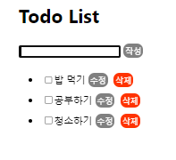
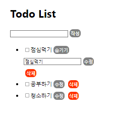
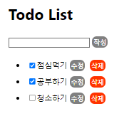

#### 목차

- [React](#react)
  * [1. Redux](#1-redux)
    + [1-1. Redux Toolkit](#1-1-Redux Toolkit)
  * [출처](#출처)

# React

## 1. Redux Toolkit

- Store
  - state
    - 정보가 저장되는 곳
    - state를 직접 변경해서는 안됨
  - reducer
    - dispatch가 전달한 2가지 값을 받음
      - 현재 state, action
    - 현재 state를 받아서 action 내용을 기반으로 state를 가공시킨 후 그것을 다시 return 
  - dispatch
    - action이 전달되면 reducer를 호출해서 state를 변경시킴
    - 변경되면 subscribe를 이용해서 render함수를 호출
  - subscribe
    - state의 값이 변경될 때마다 render함수를 호출할 수 있도록 도와줌
  - getState
    - state에 직접 접근하는 대신 사용

```javascript
// store.js

import { configureStore } from "@reduxjs/toolkit";
import todoReducer from "./todo_slice";

export default configureStore({
  reducer: {
    todos: todoReducer,
  },
});
```

- configureStore는 기존 createStore 함수를 wrapping한 함수로 기존 reducer 함수를 합치는 과정을 수행

- 기존 react에서는 component 간의 의존성이 높아서 하나의 component를 수정, 삭제하였을 경우 다른 코드와 연결되어 있기 때문에 오류가 발생
- redux를 사용하면 각각의 component는 상태가 변경되었을 경우 store에 dispatch하는 것을 통해 변경사항을 저장하기 때문에 다른 component와 연결되어 있지 않아도 됨

```javascript
// todo_slice.js

const todoSlice = createSlice({
  name: 'todos',
  initialState: [
  ],
  reducers: {
    addTodo: (state, action) => {
      const newTodo = {
        id: Date.now(),
        title: action.payload.title,
        completed: false,
      };
      state.push(newTodo);
    },
    changeComplete: (state, action) => {
      const index = state.findIndex((todo) => todo.id === action.payload.id);
      state[index].completed = action.payload.completed
    },
    deleteTodo: (state, action) => {
      return state.filter((todo) => todo.id !== action.payload.id);
    },
    updateTodo: (state, action) => {
      const index = state.findIndex((todo) => todo.id === action.payload.id);
      state[index].title = action.payload.title
    }
  }
})

export const { addTodo, changeComplete, deleteTodo, updateTodo } = todoSlice.actions;
export default todoSlice.reducer;
```

- createSlice를 사용하여 초기값과 reducer를 간편하게 작성할 수 있음


- 기본 페이지

​	

- 수정하기

​	

- 체크하기

​	


## 출처

- https://velog.io/@bisari31/Redux-Toolkit%EC%9D%84-%EC%9D%B4%EC%9A%A9%ED%95%9C-TodoList-%EB%A7%8C%EB%93%A4%EA%B8%B0
- https://www.youtube.com/playlist?list=PLuHgQVnccGMB-iGMgONoRPArZfjRuRNVc
